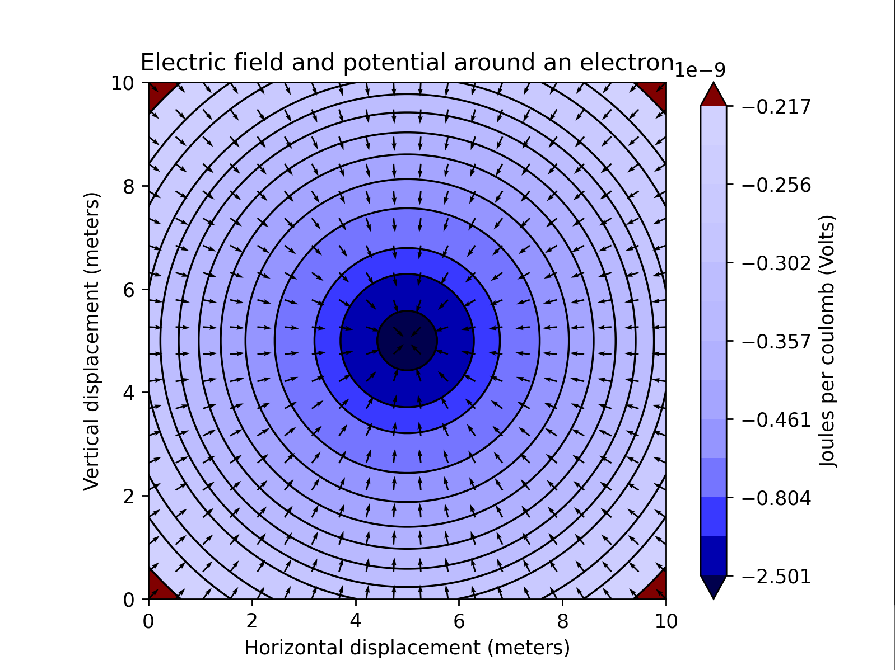
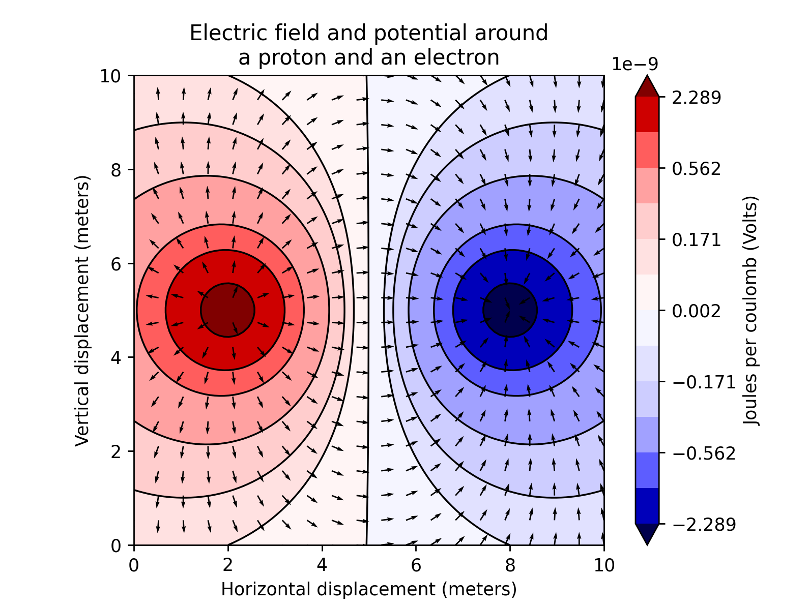
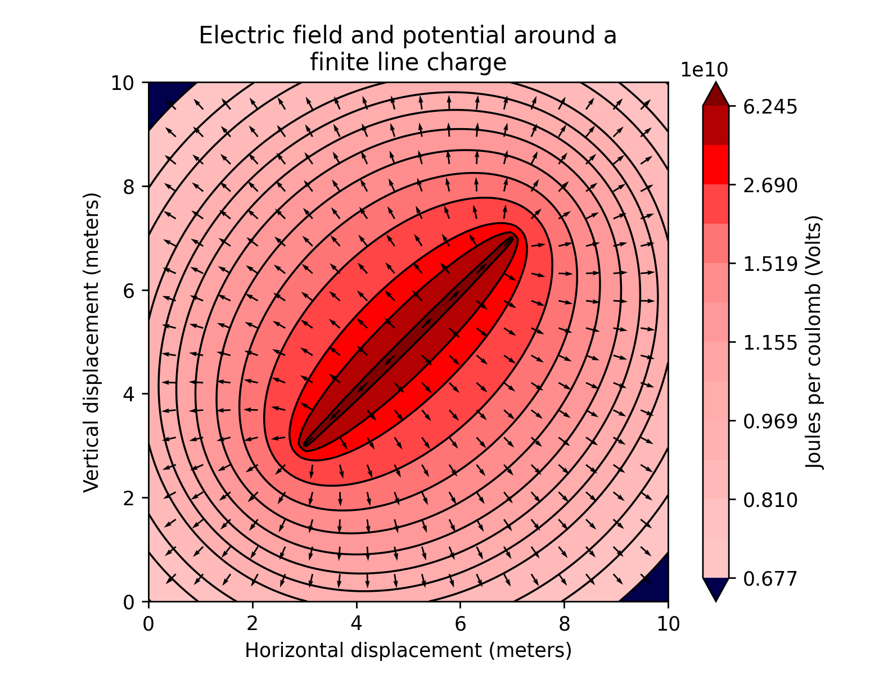
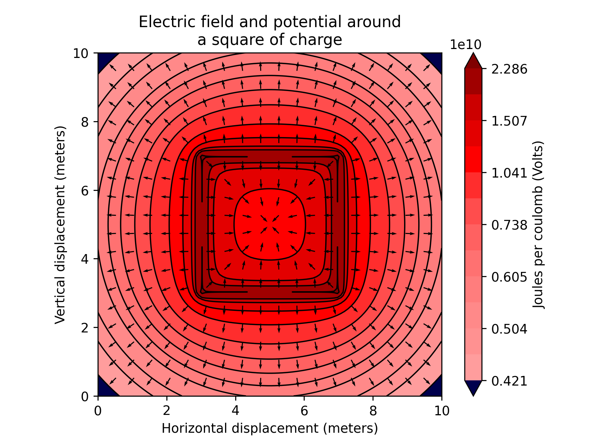

# charges
Simulates electric potential and field around charges of arbitrary shape using the finite element method.

## Usage
```pip install -r requirements.txt```

```python charges_(example)``` where **(example)** is the remainder file name of the program you want to run.

## Simulation
Uses electric field of point charge equation.

All structures have linearly distributed charge.

Simple charge structures such as finite line segments and circles of charges are simulated with numerical integration.

## Gallery







